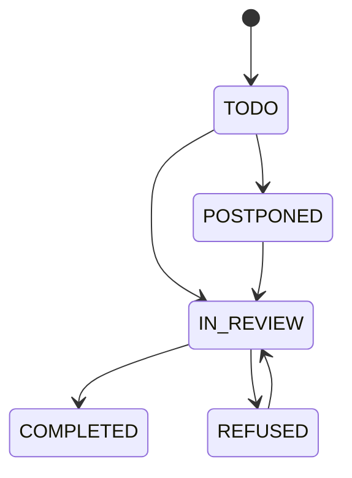

# Pronunciation module

## State diagram

A registration can have the following states: 

```mermaid
stateDiagram-v2
    [*] --> TODO

    TODO --> IN_REVIEW
    TODO --> POSTPONED
    POSTPONED --> IN_REVIEW
    IN_REVIEW --> COMPLETED
    IN_REVIEW --> REFUSED
    REFUSED --> IN_REVIEW
```
