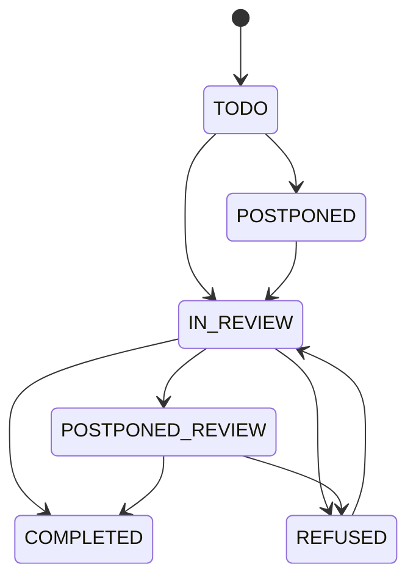

# Pronunciation module

## State diagram

A registration can have the following states: 

## Dependencies

This module depends on JAVE (Java Audio Video Encoder) to convert audio files. Currently, the pom includes the binaries for MacOS M1 and Linux 32/64 bit.
If other platforms have to be supported, the pom.xml file has to be updated accordingly.
